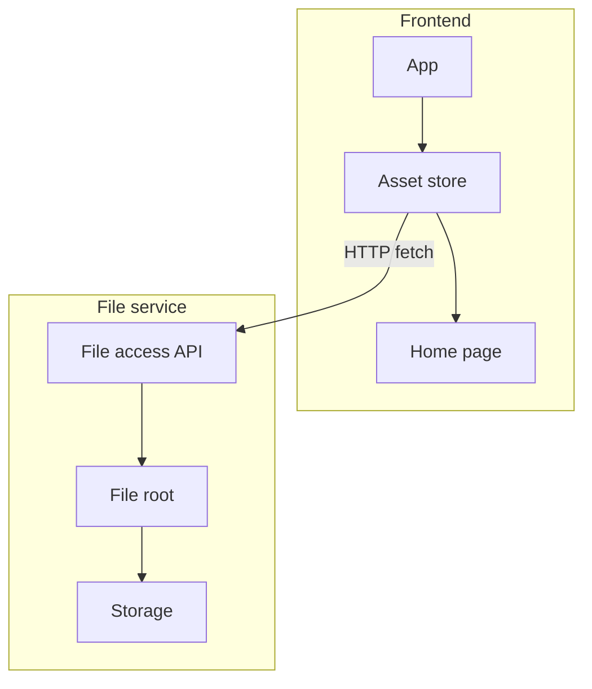

# Personal Homepage

A React.js/Zustand-based personal homepage project for personal homepage.

This project relies on [Yamd](https://github.com/wwf971/Yamd) for document rendering.

## System Architecture

The above graph only represents current design, and architecture is being actively updated.